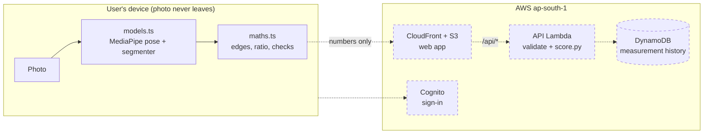
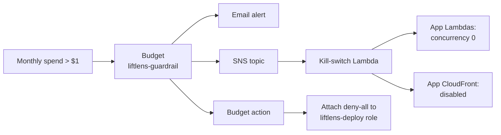

# LiftLens

**Gym-goers can't objectively track physique progress from photos.**

Progress photos are compared by eye, and lighting, camera distance, posture and memory all get in the way. LiftLens turns a front-facing photo into a measurement you can track and check.

**[Read the project story](docs/project-story.md)**: the problems, decisions and fixes behind LiftLens, in SOART format.

## How it works

- **Measures in your browser.** A pose model and a body-outline model run on your own device and measure your shoulder and waist widths. The photo is never uploaded ([ADR-002](docs/adr/002-pose-extraction-in-browser.md)).
- **Tracks one honest number.** Your shoulder-to-waist ratio, measured edge to edge on your outline. Ratios don't depend on how far away the camera was, so photos stay comparable ([ADR-004](docs/adr/004-scale-free-measurements.md)).
- **Explains every result.** Your first photo shows the ratio; later photos show the percent change since then, with the formula, the inputs and a one-sentence explanation. Changes within ±2% are reported as noise, not progress ([scoring](docs/scoring.md)).
- **Compares you only with you.** No "ideal body", no comparison with other users.
- **Costs $0/month to run**, enforced by automatic guardrails.

## Status

| Milestone | | |
|---|---|---|
| M0 Guardrails | ✅ | Budget alerts, budget action, kill switch, deployed and tested |
| M1 Measurement engine | ✅ | Browser measurement (TypeScript) matching the Python prototype; scoring module |
| M2 Auth, API, data | ⏳ | Next |
| M3 Frontend | | Capture, preview, results, history chart |
| M4 Deploy | | S3 + CloudFront |
| M5 CI/CD | | GitHub Actions with OIDC |
| M6 Portfolio finish | | Screenshots, cost write-up |

## Architecture

Solid boxes and arrows are built; dashed ones are planned.



`score.py` itself is built and tested; the Lambda that runs it is planned.

### Cost guardrails

A separate Terraform stack that is never destroyed with the app ([infra/README.md](infra/README.md)).



The kill switch finds app resources by tag (`Project=LiftLens`, `Stack=app`), so it never stops itself or touches stored data. Restoring service is a manual step.

## Key decisions

| ADR | Decision | Why |
|---|---|---|
| [001](docs/adr/001-serverless-terraform.md) | Serverless on AWS, managed with Terraform | Always-on servers and databases bill by the hour; Terraform shows exactly what will change before anything is created |
| [002](docs/adr/002-pose-extraction-in-browser.md) | Pose detection runs in the browser | Physique photos are highly sensitive; if LiftLens never receives them there is nothing to leak |
| [003](docs/adr/003-lambda-concurrency-exception.md) | No reserved Lambda concurrency yet | The account's limit of 10 allows none; a quota increase is requested |
| [004](docs/adr/004-scale-free-measurements.md) | Measurements are scale-free | Shoulders and waist are both measured edge to edge, and a photo shows shape, not size, so LiftLens reports ratios instead of centimetres |
| [005](docs/adr/005-store-ingredients-recompute-scores.md) | Store measurement ingredients, recompute scores | Photos are gone after each check-in, so saving the raw numbers lets better formulas apply to the whole history |

## Repository layout

| Path | Contents |
|---|---|
| `frontend/` | React + TypeScript + Vite app; `src/measure/` is the measurement engine |
| `backend/api/` | Measurements API Lambda: token check, validation, DynamoDB, scores ([contract](docs/api.md)) |
| `backend/scoring/` | Explainable scoring (Python) |
| `backend/kill_switch/` | Cost kill-switch Lambda |
| `infra/guardrails/` | Terraform: budget, budget action, deploy role, kill switch (deployed) |
| `infra/app/` | Terraform: application stack (from M2) |
| `dev/` | Python prototype and the script that exports reference numbers for tests |
| `docs/` | ADRs, [API contract](docs/api.md) and [scoring](docs/scoring.md) |

## Running locally

```sh
# Measurement engine (TypeScript)
cd frontend && npm install && npm test

# Scoring and kill switch (Python)
python3 -m venv backend/.venv && backend/.venv/bin/pip install pytest boto3 -r backend/api/requirements.txt
cd backend/scoring && ../.venv/bin/python -m pytest
cd ../api && ../.venv/bin/python -m pytest
cd ../kill_switch && ../.venv/bin/python -m pytest
```

The parity tests compare the TypeScript maths with the Python reference on real photos. Photos are never committed, so those tests skip unless you add your own to `dev/fixtures/` and run `dev/export_fixture.py` (see the script for setup).

## Deploying

Infrastructure is deployed with Terraform from your machine using AWS IAM Identity Center (no access keys).

```sh
aws sso login --profile liftlens
cd infra/guardrails
echo 'alert_email = "you@example.com"' > terraform.tfvars   # gitignored
AWS_PROFILE=liftlens terraform init
AWS_PROFILE=liftlens terraform plan -out=guardrails.tfplan   # review every resource
AWS_PROFILE=liftlens terraform apply guardrails.tfplan
```

The guardrails stack is always applied with the SSO admin profile so it stays fixable while the deploy role is locked. The app stack will be deployed with the `liftlens-deploy` role from M2.

## Cost

Everything is serverless and billed per use, within AWS's always-free allowances. Nothing bills by the hour. If spend ever passes $1 in a month, the guardrails above stop the app and lock deploys.
