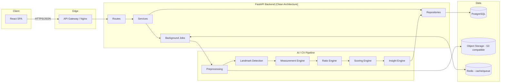
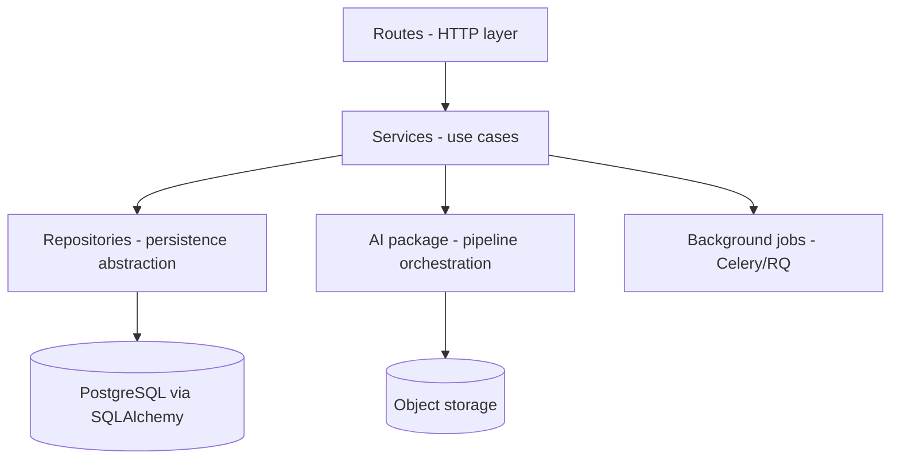
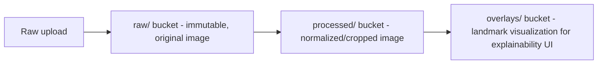
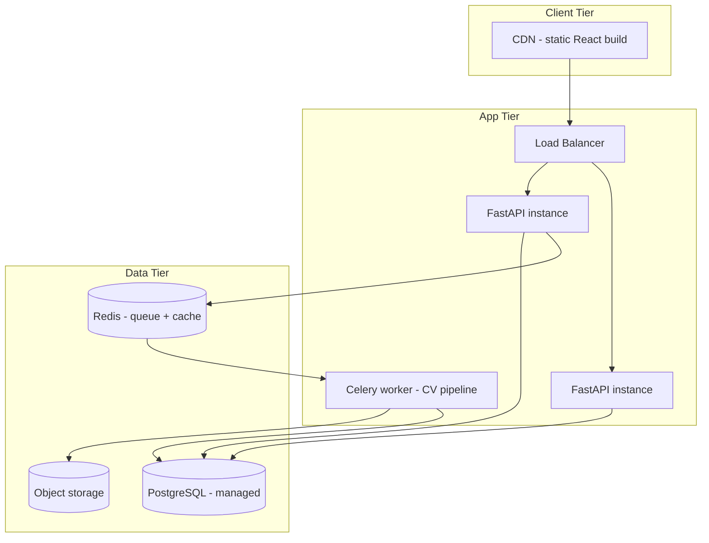

# LiftLens — System Architecture

## 1. What LiftLens is

LiftLens turns a standardized set of physique photos (front / side / back, fixed distance and pose)
into objective anthropometric measurements, explainable derived metrics, and a longitudinal
progress record. The core design constraint: **every number the product shows must be traceable
to a measurable input.** There is no black-box "AI score" — see `scoring-engine.md`.

## 2. Design principles

1. **Explainability over cleverness.** If a score can't be decomposed into the raw measurements
   that produced it, it doesn't ship.
2. **Deterministic core, probabilistic edges.** Landmark detection is the only place true ML
   uncertainty enters the system. Everything downstream (ratios, scores, insights) is
   deterministic arithmetic over those landmarks, so it's reproducible and testable without
   a GPU.
3. **Pipeline as data, not code.** The CV pipeline is a sequence of independently testable,
   independently versioned stages (see `vision-pipeline.md`). Each stage's output is a
   serializable artifact, not just an in-memory object — this is what makes confidence scoring,
   re-processing, and debugging possible later.
4. **Reuse before rewrite.** This is a greenfield repo today, but the same rule applies going
   forward: don't restructure folders that already work.
5. **Boring technology at the edges, interesting technology at the core.** FastAPI, Postgres,
   S3-compatible storage, React — nothing exotic in the scaffolding. The differentiated IP is the
   measurement/scoring pipeline, and that's where engineering effort should concentrate.

## 3. High-level system diagram

## 4. Frontend architecture (summary — full detail in `frontend.md`)

React SPA, feature-based structure, thin API service layer talking to a versioned REST API.
No business logic (ratio math, scoring) duplicated client-side — the client renders what the
backend computed, so there is exactly one source of truth for "how a score is derived."

## 5. Backend architecture (summary — full detail in `backend.md`)

Clean Architecture / layered:

Routes never talk to the database or the AI pipeline directly — only to services. This is the
single rule that keeps the codebase testable and keeps the AI pipeline swappable.

## 6. AI architecture

The CV pipeline runs **out of the request/response cycle** — image analysis takes seconds,
not milliseconds, so it's a background job. The API accepts an upload, returns immediately with
a job ID, and the client polls or subscribes for the result. Full detail in `vision-pipeline.md`.

## 7. Database architecture (summary — full detail in `database.md`)

PostgreSQL. Every measurement is versioned against the pipeline version that produced it, so
model upgrades never silently corrupt historical comparisons.

## 8. Storage architecture

- **Raw images are immutable and never overwritten** — this is what allows re-running the
  pipeline after a model upgrade without asking the user to re-upload.
- Object storage (S3-compatible: AWS S3 or a self-hosted MinIO for local/dev) — not the
  database — holds binary data. Postgres holds pointers (keys/URLs) and metadata only.
- Signed, time-limited URLs are issued to the frontend; images are never served directly from
  a public bucket.

## 9. Deployment architecture

- **Dev:** Docker Compose (API + worker + Postgres + Redis + MinIO) — one command, no cloud
  dependency, so the CV pipeline is fully testable offline.
- **Prod (portfolio-appropriate):** a single managed-Postgres + containerized API/worker
  deployment (Render/Fly.io/Railway-class platform) is enough to demonstrate the architecture
  without paying for infrastructure a portfolio project doesn't need. The diagram above is
  what you'd scale *to*, not what you need to provision on day one — over-provisioning
  infrastructure for a project with zero users is a common self-inflicted portfolio mistake
  and worth avoiding explicitly.

## 10. Cross-cutting concerns

- **Versioning:** every pipeline stage, every model checkpoint, and every scoring formula is
  version-stamped and stored alongside its output (see `database.md` §Versioning).
- **Confidence, not certainty:** landmark detection confidence propagates downstream; the UI
  must be able to say "this measurement is low-confidence" rather than presenting everything
  with false precision.
- **Auth:** JWT-based, see `api.md` §Authentication.
- **Observability:** structured logging per pipeline stage with stage-level timing, so a slow
  or failing stage is diagnosable without re-running the whole pipeline.
