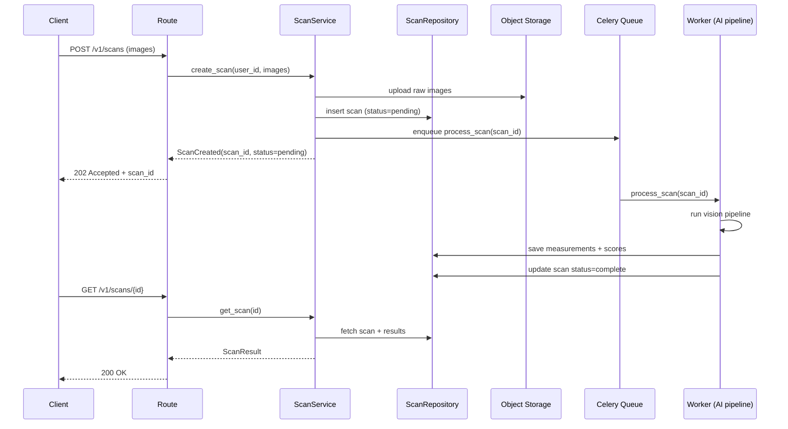

# LiftLens — Backend Architecture

Stack: **Python 3.12, FastAPI, SQLAlchemy 2.0, Pydantic v2, Celery + Redis, PostgreSQL.**

FastAPI is the right call here specifically because the CV/ML pipeline (OpenCV, MediaPipe/
landmark models, NumPy) is Python-native — a Node backend would mean a cross-language RPC
hop into a Python inference service for every single request, which is complexity this project
doesn't need to take on.

## Folder structure

```
backend/
├── app/
│   ├── api/
│   │   └── v1/
│   │       └── routes/        # HTTP layer only — no business logic
│   ├── services/               # Use-case orchestration (the "business logic")
│   ├── repositories/           # Persistence abstraction over SQLAlchemy
│   ├── models/                 # SQLAlchemy ORM models (DB schema)
│   ├── schemas/                # Pydantic request/response contracts
│   ├── ai/
│   │   ├── preprocessing/
│   │   ├── detection/
│   │   ├── measurement/
│   │   ├── scoring/
│   │   └── insight/
│   ├── core/                   # config, security, logging, DI wiring
│   ├── jobs/                   # Celery task definitions
│   ├── utils/                  # Pure, stateless helper functions
│   └── db/
│       └── migrations/         # Alembic migrations
└── tests/
    ├── unit/
    └── integration/
```

## Layer responsibilities

**Routes** — parse/validate the HTTP request into a Pydantic schema, call exactly one service
method, return the response schema. No SQL, no pipeline calls, no business rules here. This is
what makes the API layer trivially testable and swappable (e.g., adding a GraphQL layer later
means writing new routes, not touching services).

**Services** — one class per bounded use case (`ScanService`, `ProgressService`,
`UserService`). This is where orchestration lives: "create a scan record, enqueue the pipeline
job, return the job handle." Services depend on repository *interfaces*, not concrete
implementations — this is what makes them unit-testable without a real database.

**Repositories** — the only layer that speaks SQLAlchemy. Each repository exposes
domain-meaningful methods (`get_latest_scan_for_user`, `save_measurement_set`) rather than
generic CRUD, so services read like business logic, not database queries.

**Models** — SQLAlchemy ORM classes. Mirror the schema in `database.md` exactly; this is the
single source of truth for table structure, enforced via Alembic migrations.

**Schemas** — Pydantic models for every request and response. Never reuse an ORM model as an
API response directly — this is the boundary that lets the DB schema evolve without breaking
API consumers, and vice versa.

**AI package** — the CV pipeline, described fully in `vision-pipeline.md`. Each subpackage
(`preprocessing`, `detection`, `measurement`, `scoring`, `insight`) exposes a single well-typed
entry function and is independently unit-testable with fixture images/landmarks — no network,
no database, no FastAPI dependency. This isolation is what makes the pipeline portable if it
ever needs to move to a separate inference service.

**Core** — configuration (Pydantic `BaseSettings`, env-driven), security (JWT
encode/decode, password hashing), logging setup, dependency-injection wiring for FastAPI.

**Jobs** — Celery task wrappers around service calls. Thin by design: a job function loads its
inputs, calls a service method, and lets the service do the work — so the same logic is
reachable from a job, from a route, and from a test, with zero duplication.

**Utils** — genuinely stateless, dependency-free helpers (unit conversions, image geometry
helpers). If a "util" starts needing a database session, it's a service, not a util.

## Request lifecycle example: submitting a scan



## Why 202-Accepted-and-poll, not synchronous

A single scan can take several seconds to run through detection → measurement → scoring →
insight generation. Blocking an HTTP request for that long is a reliability and scalability
anti-pattern (timeouts, held connections, no retry story). The async job pattern above is
standard practice for any pipeline in the seconds-to-minutes range, and it's also what
demonstrates understanding of production ML-serving patterns to an interviewer — a synchronous
`/analyze` endpoint would be the naive version of this system.
