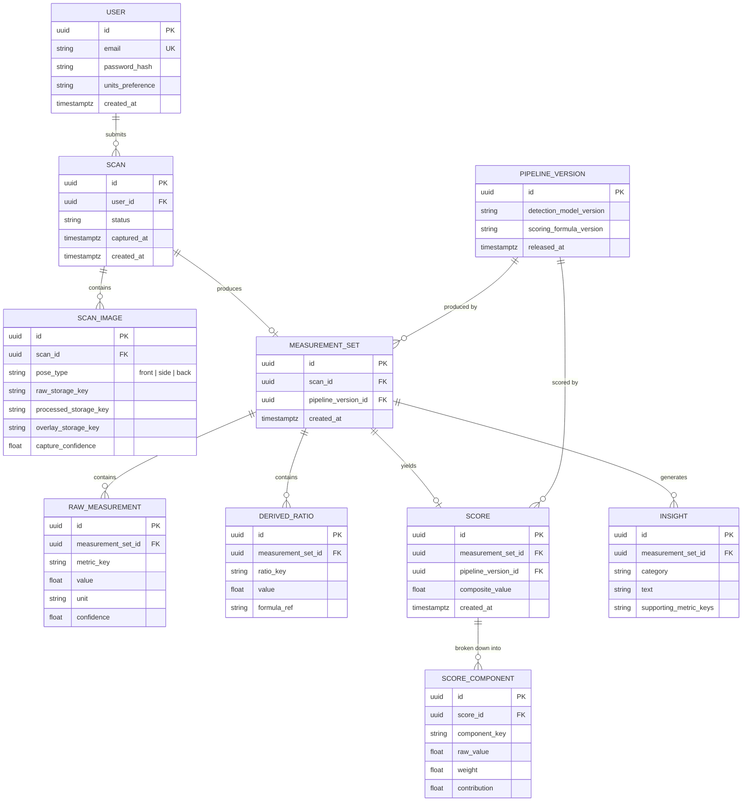

# LiftLens — Database Architecture

PostgreSQL. Chosen over a document store because the data is fundamentally relational
(users → scans → measurements → scores, with versioning joins across all of it), and because
strong typing + constraints matter for a system whose entire value proposition is numerical
trustworthiness.

## Entity-relationship diagram

## Table notes

- **SCAN_IMAGE.pose_type** is constrained (`front`/`side`/`back`) at the DB level via a check
  constraint or enum type — invalid pose labels should be structurally impossible, not just
  application-validated.
- **RAW_MEASUREMENT / DERIVED_RATIO use a key-value shape** (`metric_key`, `value`) rather than
  one column per measurement. This is deliberate: the Measurement Engine's metric list (see
  `measurement-engine.md`) will grow over the project's lifetime, and a wide table means a
  migration every time a metric is added. The tradeoff (harder to write raw SQL aggregate
  queries) is acceptable because all aggregate/trend queries go through the Measurement/Progress
  services, not ad-hoc SQL.
- **SCORE_COMPONENT is what makes the score explainable at the data layer**, not just in the
  UI: every composite score's stored contributions can be independently re-summed to verify
  `composite_value`, which means "explainability" is a property you can unit-test against the
  database, not just a UI affordance.

## Versioning & historical tracking

`PIPELINE_VERSION` is the backbone of reproducibility. Every `MEASUREMENT_SET` and `SCORE` is
foreign-keyed to the pipeline version that produced it. This means:

- Upgrading the landmark-detection model doesn't silently change what a scan from six months
  ago "means" — old results stay attributed to the old version.
- Re-processing historical raw images (which are kept immutable in storage specifically for
  this) against a new pipeline version creates *new* `MEASUREMENT_SET`/`SCORE` rows rather than
  overwriting old ones, so a user's progress chart can show "recomputed with v2 model" as a
  distinct, comparable series instead of corrupting history.

## Indexes

- `scan(user_id, captured_at DESC)` — the dominant query pattern is "this user's scans, most
  recent first," for both history and progress-chart views.
- `measurement_set(scan_id)`, `raw_measurement(measurement_set_id, metric_key)` — supports
  both "give me everything for this scan" and "give me this metric's trend across all scans,"
  the latter via a join through `scan.user_id`.
- `score(measurement_set_id)` unique — one score per measurement set, enforced.
- Partial index on `scan(status)` where `status != 'complete'` — the job worker needs to find
  pending/failed scans quickly without scanning the whole table.

## Future extensibility (deliberately not built in Sprint 1)

- **Multi-metric-set comparisons** (side-by-side of 3+ scans) — the schema already supports it;
  it's a query/UI feature, not a schema change.
- **Social/coach-sharing** — would need a `SCAN_SHARE` join table with scoped permissions;
  out of scope until there's a validated reason a user wants it.
- **Custom scoring weights per user goal** (e.g. "prioritize symmetry over size") — would add a
  `SCORING_PROFILE` table referenced by `SCORE`; deferred until the default scoring model is
  validated against real users.
