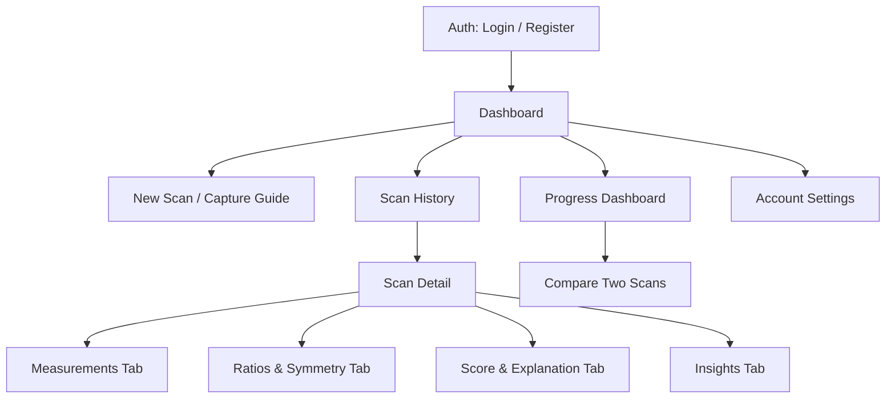

# LiftLens — Frontend Architecture

Stack: **React (Vite), TypeScript, React Query for server state, Zustand for lightweight client
state, Tailwind CSS, Recharts for progress visualization.**

## Folder structure

```
frontend/
├── src/
│   ├── pages/          # Route-level components — compose features, own no logic
│   ├── features/        # Feature-sliced modules (scan-upload, progress, insights, auth...)
│   │   └── <feature>/
│   │       ├── components/
│   │       ├── hooks/
│   │       └── api.ts
│   ├── components/      # Shared, feature-agnostic UI primitives (Button, Card, Modal)
│   ├── hooks/            # Shared cross-feature hooks (useAuth, useDebounce)
│   ├── services/         # API client (typed fetch wrappers), one module per backend resource
│   ├── providers/        # React context providers (Auth, Theme, QueryClient)
│   ├── layouts/           # Shell layouts (DashboardLayout, AuthLayout)
│   └── types/             # Shared TS types, generated/mirrored from backend Pydantic schemas
└── tests/
```

## Why feature-based, not type-based

A `components/`, `pages/`, `hooks/` split with no feature boundary works for small apps and
degrades badly here: "scan upload," "progress tracking," and "insight display" are genuinely
separate domains with their own state and API surface. Feature-sliced structure means adding
the insight-engine UI later touches `features/insights/` and nothing else — a `git blame` or a
new-contributor onboarding both read cleanly, which matters for a portfolio piece an interviewer
might actually browse.

## Layer responsibilities

- **pages/** — route targets only. A page imports and arranges features; it should be readable
  in one screen and contain no business logic or data-fetching logic itself.
- **features/** — the real unit of modularity. Each feature owns its components, its hooks,
  and its typed API calls. Features may depend on `components/`, `hooks/`, `services/`, `types/`
  — never on each other directly (cross-feature composition happens at the page level).
- **components/** — dumb, reusable, no knowledge of any specific feature or API shape.
- **services/** — one typed module per backend resource (`scans.ts`, `progress.ts`,
  `auth.ts`), wrapping fetch/React Query. This is the *only* place that knows API URLs and
  response shapes — features consume it, never call `fetch` directly.
- **providers/** — global context: auth session, theme, the React Query client.
- **layouts/** — shell chrome shared across pages (nav, sidebar, header).
- **types/** — the TypeScript mirror of backend Pydantic schemas. Kept in sync manually at this
  stage; codegen (e.g. `openapi-typescript` against the FastAPI OpenAPI spec) is a reasonable
  Sprint 3+ upgrade once the API stabilizes.

## Page hierarchy & navigation



## Page-by-page description

- **Login / Register** — standard auth, JWT stored in memory (not localStorage, to reduce XSS
  token-theft surface) with refresh-token rotation.
- **Dashboard (home)** — the "since your last scan" summary: latest score, trend sparkline,
  and a prompt to start a new scan if none exists in the last capture interval.
- **New Scan / Capture Guide** — walks the user through the three standardized poses
  (front/side/back) with an on-screen silhouette overlay and live feedback ("step back,"
  "align shoulders") — this is the UI counterpart to the Validation stage in the vision
  pipeline; catching a bad photo *before* upload is far cheaper than catching it after.
- **Scan History** — chronological list of all scans with status (processing/complete/failed)
  and thumbnail.
- **Scan Detail** — the core explainability surface, tabbed:
  - *Measurements* — raw numbers with the landmark overlay image, so the user can visually
    verify what was measured.
  - *Ratios & Symmetry* — derived ratios with plain-language explanation of each.
  - *Score & Explanation* — the composite score with a full breakdown of contributing inputs
    (see `scoring-engine.md`) — never a bare number.
  - *Insights* — natural-language observations generated from the measurement deltas.
- **Progress Dashboard** — time-series charts per measurement/ratio, with the ability to
  select a date range.
- **Compare Two Scans** — side-by-side landmark overlays and a diff table of every metric.
- **Account Settings** — profile, units (metric/imperial), data export/delete (relevant for a
  product handling body-image data — see `roadmap.md` for when privacy controls land).

## What does NOT live client-side

No ratio math, no scoring formulas, no measurement logic runs in the frontend. The frontend
renders backend-computed results. This isn't just clean layering — it's the same explainability
guarantee from `scoring-engine.md` applied to the client: there is exactly one implementation
of "how a number is derived," and it lives in one place.
