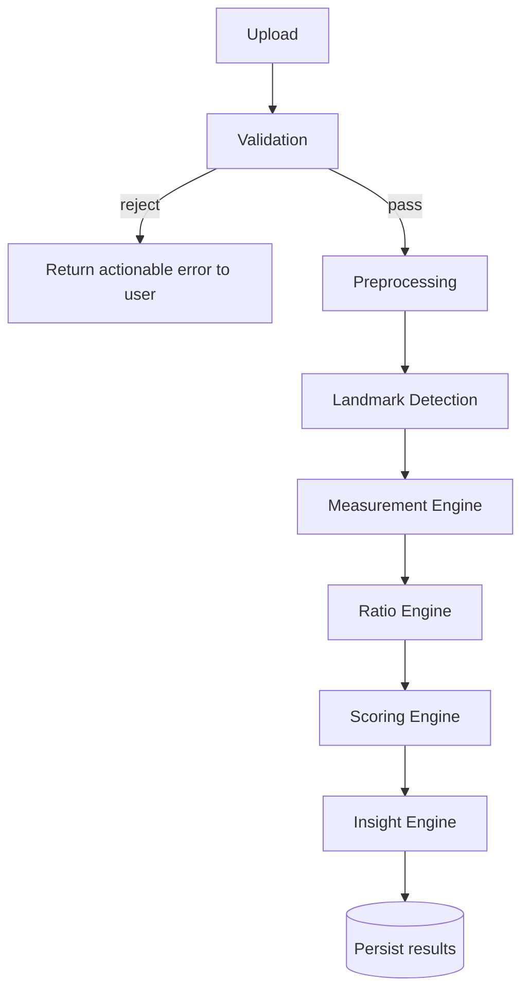

# LiftLens — Computer Vision Pipeline

## Pipeline overview

Each stage is a pure function: `Stage(input_artifact, config) -> output_artifact`. No stage
reaches into the database or the network directly — the orchestrator (a Celery task) is
responsible for I/O; stages are responsible for computation. This is what makes every stage
unit-testable with a fixture image and no infrastructure.

## Stage-by-stage

### 1. Upload
Accepts three images (front/side/back) plus lightweight client-side metadata (device, capture
timestamp). Files land in the `raw/` storage bucket immediately, unmodified — this is the
permanent, immutable source of truth that allows re-processing later.

### 2. Validation
Rejects unusable input *before* spending compute on it. Checks:
- Correct number of images for the pose set.
- Minimum resolution.
- A person is detected in frame at all (cheap detector pass, not full landmark extraction).
- Roughly correct pose orientation (front image isn't actually a side shot, etc.) using a fast
  heuristic (shoulder-line vs. hip-line angle from a lightweight pose check).

A rejection returns a specific, actionable reason ("no person detected," "image too dark,"
"looks like a side pose in the front-pose slot") — a generic "upload failed" is a UX and
debugging dead end.

### 3. Preprocessing
- Auto-orientation (EXIF rotation correction).
- Resize/normalize to the resolution the detection model expects.
- Contrast/exposure normalization — physique photos are taken in wildly inconsistent lighting,
  and normalizing here reduces variance the detection model would otherwise have to absorb.
- Background handling: no segmentation model is assumed available at Sprint 1; simple center-
  crop framing is enough to constrain the search space for detection.

### 4. Landmark Detection
Runs a pose-estimation model (MediaPipe Pose or an equivalent keypoint model) to extract 2D
body landmarks (shoulders, hips, elbows, wrists, knees, ankles, etc.) with a per-landmark
confidence score. **This is the only stage with genuine model uncertainty** — everything after
this point is deterministic geometry over the landmark coordinates, which is precisely why the
confidence values produced here must propagate all the way to the UI rather than being
discarded.

Output artifact: normalized landmark coordinates + per-landmark confidence, per pose image.

### 5. Measurement Engine
Converts landmark coordinates into physical/relative measurements. Full detail in
`measurement-engine.md`. This is pure geometry (distances, angles) over landmark pairs — no
further ML inference happens here, which is what keeps this stage deterministic and testable
with hand-constructed landmark fixtures (no image or model needed in unit tests).

### 6. Ratio Engine
Computes derived ratios from raw measurements (e.g. shoulder-to-waist ratio). Every ratio is a
named, documented formula over two or more raw measurements — never a learned/opaque
combination.

### 7. Scoring Engine
Combines ratios and symmetry/posture metrics into a small set of interpretable composite scores.
Full detail and philosophy in `scoring-engine.md`.

### 8. Insight Engine
Generates natural-language observations by comparing the current measurement set against the
user's own history (not against other users) — e.g. "shoulder-to-waist ratio improved 4% since
your last scan." Template-driven, not free-generation, so every sentence is traceable to a
specific metric delta — this keeps the insight layer within the same explainability guarantee
as the score.

### 9. Storage
Persists `MeasurementSet`, `RawMeasurement`, `DerivedRatio`, `Score`, `ScoreComponent`, and
`Insight` rows, all tagged with the `PipelineVersion` that produced them (see `database.md`).
Landmark overlay images are rendered and stored alongside the processed image, specifically to
power the "Measurements" tab's visual verification in the UI.

## Failure handling

Any stage can fail (e.g., detection confidence too low to produce a trustworthy measurement).
Failures are captured per-stage with the specific stage name and reason, and the scan's status
is set to `failed` with that reason surfaced to the user — never a silent partial result
presented as if it were complete.

## Why this stage boundary, not a single monolithic "run inference" function

Splitting Detection / Measurement / Ratio / Scoring / Insight into separate stages costs a bit
of plumbing (typed artifacts passed between stages) but buys:
- Independent unit testing of the 90% of this pipeline that's pure geometry, without ever
  invoking the actual pose model in CI.
- The ability to upgrade the detection model in isolation and re-run only from stage 5 onward
  against stored landmark artifacts, instead of re-running everything.
- A natural place to add confidence thresholds and reject/flag logic per stage.
